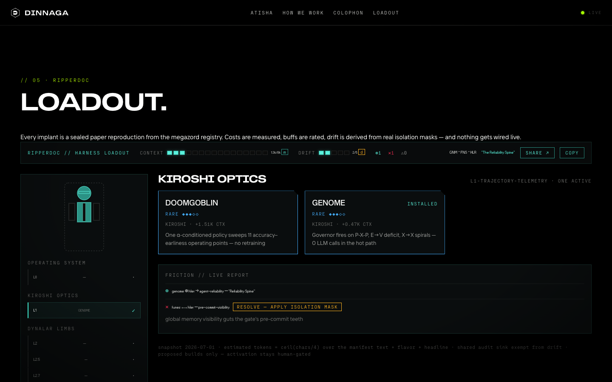
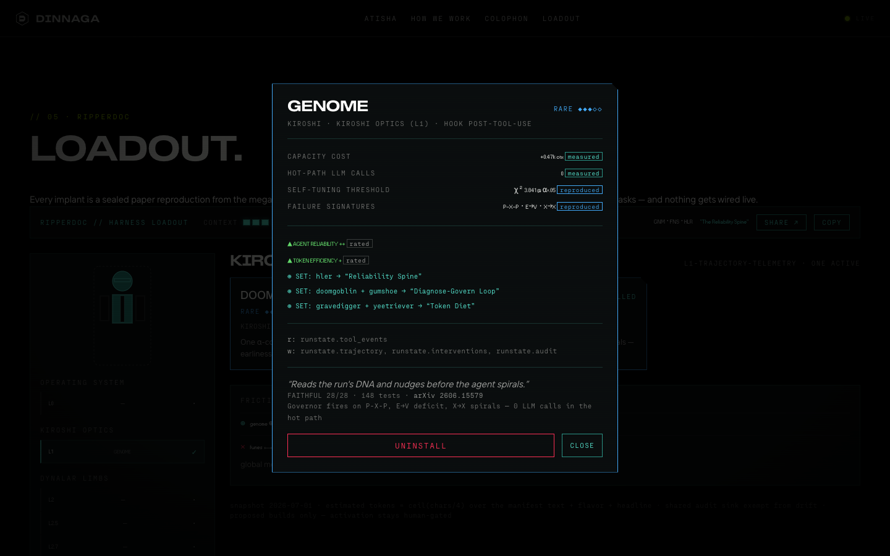
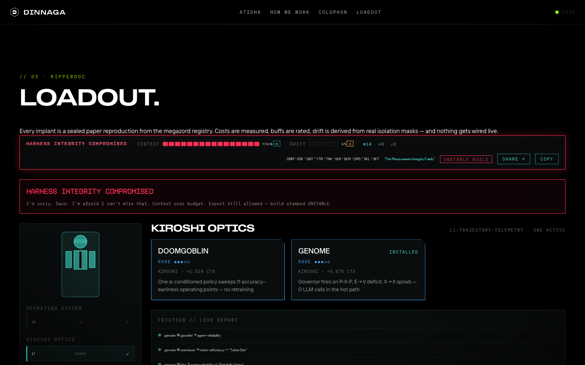
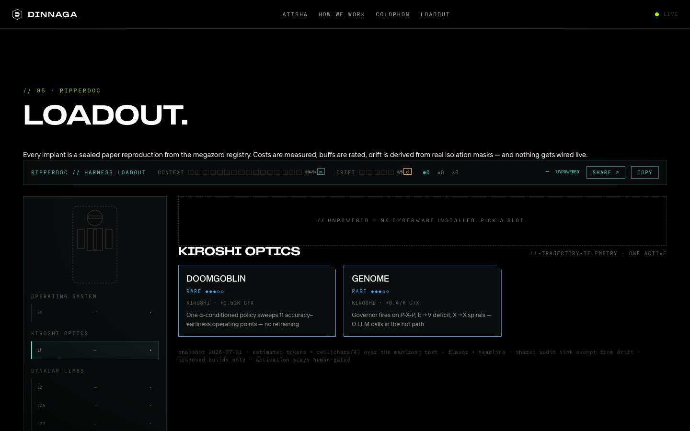

<!-- ABOUTME: Repo README for dinnaga.ai — what the site is, the loadout showcase, and how to develop/deploy it. -->
<!-- ABOUTME: Screenshots live in docs/screenshots/; operational detail lives in docs/STATUS.md. -->

# DINNAGA // dinnaga.ai

An anonymous AI research lab site. We validate what is genuinely useful, then share it openly — the site is the transmission surface: **[dinnaga.ai](https://dinnaga.ai)**.

React 19 · Vite · TypeScript (strict) · react-router 7 · plain CSS tokens · Bun. Hosted on Vercel, which deploys on every push to `main`; `.github/workflows/ci.yml` runs lint → unit tests → build as a PR/push quality gate (Vercel owns the deploy, not GitHub Actions). SPA deep links ride the `public/404.html` redirect trick.

**Routes:** `/` · `/atisha` · `/method` · `/colophon` · `/loadout`

## `/loadout` — the ripperdoc bench

A Cyberpunk-2077-style cyberware bench where our reproduced-research artifacts ("zords") are implants and an agent harness is the body you plug them into. It's a harness-metrics dashboard wearing a ripperdoc build screen: equipping an implant makes a *true statement* about whether a harness config is coherent.



- **Every stat is real and labeled.** Context cost is a measured payload estimate (`ceil(chars/4)`, disclosed on-page), benefit buffs are `rated`, drift is `derived` from the real isolation write-masks in the megazord registry, and each implant's stat rows are the reproduced paper results (e.g. thonktank's success rate `0.465 → 0.827`, gravedigger's lean-beats-full `+0.22`, skidmark-leak's `+6.87 pt` benchmark-inflation catch). The registry currently ships **22 implants** across 9 slots.
- **Friction is honest.** The funes ⟷ hler conflict on the bench is the registry's actual pre-commit-visibility conflict, resolvable by applying the documented isolation mask. Set bonuses ("Reliability Spine", "Skill Foundry", "Token Diet") are the registry's cross-layer stacks.
- **Builds are URLs.** State lives entirely in the query string — share `?b=L1genome_L3funes_L4hler&r=funes~hler` and the build restores exactly, resolution and all.



Overload the body — blow the context budget or max the drift meter — and the bench hits cyberpsychosis:



An empty body stays dormant:



**Data flow:** the private megazord registry stays canonical; this site renders a vendored snapshot (`src/data/zords.json`) produced by `bin/megazord export-json`. Refreshing it is a deliberate manual step — nothing is wired live, and activation of any zord stays human-gated.

## Develop

```bash
bun install
bun run dev        # http://localhost:4242
bun run test       # vitest unit + integration
bun run test:e2e   # playwright (chromium)
bun run lint       # eslint
bun run build      # tsc --noEmit + vite build
```

Operational status, HTTPS notes, and backlog: [docs/STATUS.md](docs/STATUS.md).

// VALIDATE · THEN SHARE
